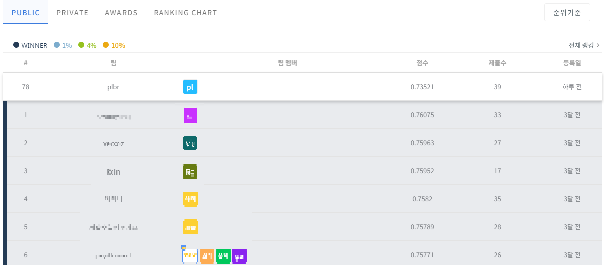
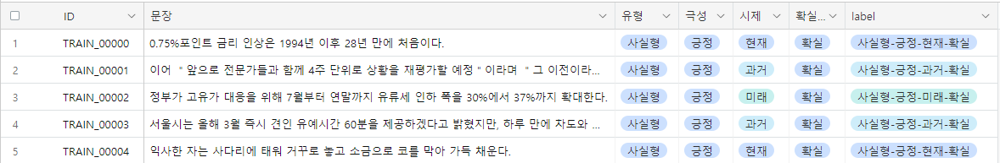

# [Dacon] 문장 유형 분류 AI 경진대회

대회링크 : https://dacon.io/competitions/official/236037/overview/description

- Public Score: 0.7352 (78위)
  - 
- Private Score: 0.7452

--------

### 🏆 대회 개요

- 문장 유형 분류 AI 모델 개발

- 문장을 입력으로 받아 문장의 '유형', '시제', '극성', '확실성'을 분류하는 AI 모델 생성

- 데이터셋 구성 

  - **train.csv [파일]**

    - ID : 샘플 문장 별 고유 ID
    - 문장 : 샘플 별 한개의 문장
    - 유형 : 문장의 유형 (사실형, 추론형, 대화형, 예측형)
    - 극성 : 문장의 극성 (긍정, 부정, 미정)
    - 시제 : 문장의 시제 (과거, 현재, 미래)
    - 확실성 : 문장의 확실성 (확실, 불확실)
    - label : 문장 별 유형, 극성, 시제, 확실성에 대한 Class (총 72개 종류의 Class 존재)

    - 데이터 예시)
      

  - **test.csv [파일]**
    - ID : 샘플 문장 별 고유 ID
    - 문장 : 샘플 별 한개의 문장

  - **sample_submission.csv [파일] - 제출 양식**
    - ID : 샘플 문장 별 고유 ID
    - label : 예측한 문장 별 유형, 극성, 시제, 확실성에 대한 Class
    - 예시) 사실형-긍정-현재-확실

-------

### 🖥 모델링

- 데이터 전처리 및 랜덤 스왑을 통해 데이터 증강
- KR-Medium BERT 모델 활용
- 5개의 KFold로 나누어 훈련
- 최종적으로 훈련된 5개의 모델 soft voting을 통해 결과 예측

-------

### 🛠 환경

- Kaggle Notebook (GPU: Nvidia P100, 무료버전)
- 내장 Python, Tensorflow

------------

### 🔑 주요했던 방법

1. Data Augmentation
   - Random Swap [(참고한 catSirup님 링크)](https://github.com/catSirup/KorEDA)
2. KR-Medium 사용 [(Hugginface 링크)](https://huggingface.co/snunlp/KR-Medium)
3. Loss Function
   - Focal Loss
   - Asymmetic Loss